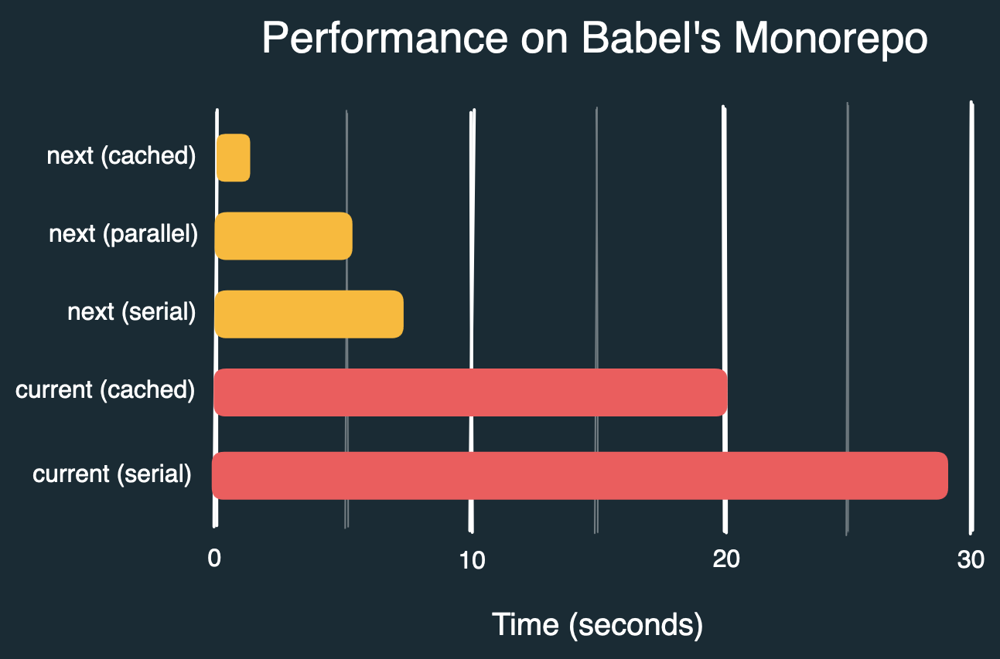

Hey, I'm [Fabio](https://twitter.com/fabiospampinato) and I've been contracted by the Prettier team to speed up Prettier's command line interface (CLI). In this post we'll take a look at the optimizations I've discovered, the process that lead to finding them, some exciting numbers comparing the current CLI with the new one, and some guesses about what could be optimized next.

<!-- truncate -->

## Installation

The new work-in-progress CLI for Prettier has just been [released](https://github.com/prettier/prettier-cli), and you can install it now:

```sh
npm install prettier@next
```

It should be largely backwards compatible:

```sh
prettier . --check # Like before, but faster
```

If you find any issues you can temporarily use the old CLI using an environment variable:

```sh
PRETTIER_LEGACY_CLI=1 prettier . --check
```

You can also try it via `npx`, though `npx` itself is pretty slow:

```sh
npx prettier@next . --check
```

The goal is to make it close to ~100% backwards compatible, and then just ship it in a future stable release of the `prettier` package, replacing the current CLI.

## Overview


Prettier's CLI works roughly like in the diagram above:

1. There's some action we want to execute on files, for example checking if they are formatted properly.
2. We need to actually find all the files to execute this action on.
3. We need to resolve `.gitignore` and `.prettierignore` files, to figure out if some of those files are to be ignored.
4. We need to resolve `.editorconfig` files, for [EditorConfig](https://editorconfig.org)-specific formatting configurations for those files.
5. We need to resolve `.prettierrc` files, and [~10 more](https://prettier.io/docs/en/configuration), for Prettier-specific formatting configurations for those files.
6. We need to check if each of the files matches its formatting configuration.
7. Finally we need to output some kind of result to the terminal.

After this high-level look at the CLI's architecture I think there are mainly 3 observations to make:

1. The amount of work to do scales with the number of target files, but most files are completely unchanged between runs of the CLI, because for example a commit in a large-enough repository generally only touches a fraction of the files, so if we could only remember work done in the previous run most of the work on the current run could be skipped.
2. There are potentially a huge number of configuration files to resolve, since our repository could have thousands of folders and each folder could have some configuration files in it, moreover if for example we find 10 different `.editorconfig` files, each of them could define different settings for files matching specific [globs](<https://en.wikipedia.org/wiki/Glob_(programming)>), so they all need to be combined together in a file-specific way, for each target file. But, in almost every case a repository is only going to contain just one or a handful of `.editorconfig` files, even if the repo has thousands of folders, so somehow this shouldn't be _that_ expensive.
3. This isn't a particularly insightful observation, but if everything a program is doing is necessary, and everything done is done efficiently, then the program itself must execute efficiently as a result, so we are generally just going to try to skip unnecessary work as much as possible, and what we can't skip we'll try to make efficient.

From these observations I started writing a new CLI for Prettier from scratch, as it's often easier to rewrite things with performance in mind from the start than to patch them to be performant.

I'll use [Babel](https://github.com/babel/babel)'s monorepo to take measurements throughout this post, as it provides a good sort of benchmark, and it should give you a sense of what the improvement will be in practice for a real, fairly large, monorepo.

## Finding files fast

First of all we need to find our target files. Prettier's current CLI uses [`fast-glob`](https://github.com/mrmlnc/fast-glob) for that, and the code for using it may look like this:

```js
import fastGlob from "fast-glob";

const files = await fastGlob("packages/**/*.{js,cjs,mjs}", {
  ignore: ["**/.git", "**/.sl", "**/.svn", "**/.hg", "**/node_modules"],
  absolute: true,
  dot: true,
  followSymbolicLinks: false,
  onlyFiles: true,
  unique: true,
});
```

If we run that on Babel's monorepo we'll see that it takes some ~220ms to find ~17k files matching our globs, out of ~30k total files found, which seems reasonably good, considering that Babel's monorepo contains over 13k folders also.

With a quick profiling we can spot that a significant amount of time is being spent checking if the found files match any of our "ignore" globs, which seem internally converted to regexes and matched one by one. So I tried merging the globs into a single one: `"**/{.git,.sl,.svn,.hg,node_modules}"`, but it seems to get internally split up again for some reason, so that didn't change anything.

By commenting our ignore globs out entirely we can find pretty much the same files, because almost none of them got actually ignored, in just around ~180ms, which is ~20% less time. So if we could match those globs differently, in a faster way, we could lower times a bit.

This is probably a good time to mention that `fast-glob` does a pretty cool optimization, if our glob looks like this: `packages/**/*.{js,cjs,mjs}`, then it can spot that the beginning of it is entirely static, what we are actually asking it to do is to search for `**/*.{js,cjs.mjs}` inside the `packages` folder only. This optimization can be significant if there are lots of files in other folders we don't actually care about, because they will just never be scanned at all.

That got me thinking: our ignore globs are basically the same, but the static part is at the end, rather than at the start. So I wrote another [library](https://github.com/fabiospampinato/tiny-readdir-glob) for finding files with a glob that is able to take advantage of globs with a static end too. The equivalent code for finding files with that would be this:

```js
import readdir from "tiny-readdir-glob";

const { files } = await readdir("packages/**/*.{js,cjs,mjs}", {
  ignore: "**/{.git,.sl,.svn,.hg,node_modules}",
  followSymlinks: false,
});
```

And it finds the same files in just around ~130ms. By commenting out the ignore glob, just to check how much overhead that adds, it seems to take about the same amount of time, so that got optimized enough that it's hard to measure its cost in this scenario.

It got faster than we perhaps expected, for a few reasons:

1. Other than the ignore glob, the `**/*.{js,cjs,mjs}` portion of the main glob ended up getting optimized too.
2. Globs are matched against the relative path of a file from the root folder we started searching from, so there would be a bunch of `path.relative` calls in there, but if our glob looks like this: `**/.git`, then it doesn't matter if we calculate the relative path or not, we'll effectively be looking at the end of that string for a child path anyway, so I'm just skipping those `path.relative` calls completely.
3. Node's [`fs.readdir`](https://nodejs.org/api/fs.html#fsreaddirpath-options-callback) API is used internally in both libraries to scan directories, and it gives us the names of the found files and folders, not their absolute paths, which is what we actually want, but we can generate that more manually, by joining the parent path and the name with the path separator, rather than by calling `path.join`, which speeds things up a bit more.

Additionally this new library is ~90% smaller, about 65kb of minified code is no longer needed, which speeds up startup for the entire CLI. In much smaller repos than Babel's the new CLI might be able to find all the target files by the time the old one just finished parsing `fast-glob`.

Rewriting this part of the CLI may seem a little heavy-handed for the kind of speed up that we got, but the main reason for the rewrite is actually another. It would seem that there should be nothing that we could do here that would speed up the CLI by multiple seconds, since finding all the files takes less than half a second to begin with, but, the crucial point to highlight here is that for the entire CLI we not only need to find files to format, but we also need to find configuration files, and knowing every single file and folder that was found, even if they didn't match our globs, is very valuable information that will allow us to shave multiple seconds later. `tiny-readdir-glob` can give us that information more or less for free, so it seemed worth writing it even just for that alone.

To summarize the perhaps interesting points from this section:

1. If you can, always tell Prettier the extensions to look for, for example with a glob like `packages/**/*.{js,cjs,mjs}`. If you used `packages/**/*` or just `packages` instead in this scenario 13k extra files would need to be processed, and it would be more expensive for Prettier to discard them later on.
2. There's always something left to optimize or special-case for performance, even in already optimized libraries, if one has the time to look into it.
3. It's worth thinking about what kind of information is being thrown away, or made somewhat expensive to reconstruct. Here the glob library has to know the found files and folders just to do its work, exposing that information to the caller unlocks additional performance basically for free, in some cases.

Guesses on how to speed this up further:

1. This seems to be bottlenecked by the performance of `fs.promises.readdir` in Node, and/or the overhead of creating a Promise for each found folder. It may be worth looking into using the callback-style version of that API, and into optimization opportunities in Node itself.

## Resolving configurations fast

This is possibly the most impactful optimization behind the new CLI, and it's basically about finding configuration files as fast as possible, for each folder only ever checking once if it contains configuration files, and parsing the found configuration files only once.

A major problem behind the current CLI is that it caches resolved configurations by file path, rather than by folder path, so for example Babel's monorepo has ~17k files to format, but only 1 `.editorconfig` file in the whole repo, we should be parsing that file once, but instead it got parsed ~17k times. Additionally if you imagine those ~17k files being under the same folder, that folder got asked if it contained an `.editorconfig` file ~17k times, so actually the deeper nested into folders files to format were, the slower the entire CLI would get.

This problem got largely solved in two steps:

1. Resolved configuration files are cached by folder path, so it doesn't matter anymore how many files each folder contains, or how deep they are into folders.
2. The found folders are now being asked basically 0 times if they contain each of the ~15 supported configuration files, because we know from the previous section every single file in the repo, so we can just do a lookup in there, which ends up being a lot faster than asking the filesystem. This wouldn't matter much in most small repos, but Babel's for example has ~13k folders, and 13k \* 15 checks with the filesystem ~~added~~ multiplied up quickly enough.

Let's now take a deeper look into how each specific supported type of configuration is resolved.

#### Resolving EditorConfig configurations

Assuming from the previous step that we've parsed every `.editorconfig` file in the repo and that we can fetch the relevant ones for any target file in constant time, what we now want to do is to merge them together into a single configuration object, for each target file, basically.

Right away this idea kinda goes out of the window, because the [`editorconfig`](https://www.npmjs.com/package/editorconfig) package doesn't provide a function for doing this. The closest one seems the one called `parseFromFiles`, which besides being deprecated it seems to do what we want, but it wants configurations as strings, so it will presumably parse them by itself after each call, which is the thing we wanted to avoid in the first place, we only want to ever parse those once.

So that package got rewritten for Prettier's needs, [`tiny-editorconfig`](https://github.com/fabiospampinato/tiny-editorconfig) provides exactly the `resolve` function we need, and it leaves the logic for finding configuration files to us, which is what we want anyway because we need to cache these files in a custom way.

While I was at it I've rewritten the [INI parser](https://github.com/fabiospampinato/ini-simple-parser) behind it too, and it seems to be ~9x faster. It shouldn't matter much, because most repos will only have 1 `.editorconfig` file in them, but I enjoy writing these little parsers, and hey if you happen to have thousands of `.editorconfig` files in your repo you'll notice the extra performance boost!

Additionally this new library is ~82% smaller, ~50kb of minified code got deleted, which speeds up startup for the whole CLI. Also it uses the same glob library that `tiny-readdir-glob` uses, while in the current CLI `fast-glob` and `editorconfig` use different ones, so actually a bit more code than that got effectively deleted.

Previously it would have taken multiple seconds to resolve these files for Babel's monorepo, now it takes roughly ~100ms.

Guesses on how to speed this up further:

1. It should be possible in some (most?) cases to pre-resolve these configuration files for any possible file path we could encounter, for example depending on the globs in them it may be possible that we can end up with 3 possible resolved configurations at most, one for files that don't match any of the globs, one for files that match the `**/*.js` glob, and one for files that match the `**/*.md` glob. It's a bit complicated to implement though, and unclear what the speedup will be in practice, but it's something to think about for the future.

#### Resolving Prettier configurations

For Prettier-specific configurations, like the `.prettierrc` file, we are also assuming that we've resolved all the found configuration files, and can retrieve them in constant time for any target file.

It's basically an identical situation to what we had for EditorConfig-specific configurations, so we'll basically do the same, this time hard-coding the logic for merging the configurations inside the CLI itself, as making a standalone package for it seems of basically no utility to the ecosystem.

The main aspects to consider here for the future are, in my opinion:

1. A large number of [different configuration files](https://prettier.io/docs/en/configuration) are supported. In Babel's monorepo this translates to ~150k lookups in the object of known paths we created in the first step, which while not super expensive it's not free either. If this number could be reduced by a lot it would speed things up a bit.
2. Also some of the parsers required to parse those configuration files are relatively expensive, the [`json5`](https://npmjs.com/package/json5) parser requires ~100x as much code as the smallest [JSONC](https://code.visualstudio.com/docs/languages/json) (JSON with Comments) parser that I know of for JavaScript, while being in some cases ~50x slower at parsing also. If fewer formats could be supported the CLI would be leaner as a result.
3. If we could check just once if a file named for example `.prettierrc.json5` got found anywhere in the repo we could reduce the number of checks for these configuration files by an order of magnitude, because if no file with that name was found anywhere in the repo then we don't need to ask each of Babel's ~13k folders if they have it. The list of all known file names is another piece of valuable information that the glob library we are using could give us for free.

#### Resolving Ignore configurations

Lastly we need to resolve `.gitignore` and `.prettierignore` files, to understand which found files to ignore. We are also assuming that we resolved all the found ones already and can fetch them in constant time for any target file.

I'm not doing any major optimizations here, I'm largely just asking [`node-ignore`](https://github.com/kaelzhang/node-ignore) to make us a function that we can call to check if a file should be ignored.

A small optimization though is skipping calling `path.relative`, and the `ignore` function itself in some cases. Ignore files match more or less the relative path of found files from the folder where the ignore file exist in, and since we know that all the paths we are dealing with are normalized, if the absolute path of a target file doesn't start with the absolute path of the folder where each ignore file existed in then that file exists outside of the folder that the ignore file manages, so we don't have to call the `ignore` function that `node-ignore` made for us.

A decent amount of time seems spent matching the globs in these files against the found files though, hundreds of milliseconds for thousands of files, because there can just be a large number of globs in these files and a large number of files to match, which multiplied together gives us roughly the number of glob matches that will be attempted in the worst case.

The nice thing about `.gitignore` and `.prettierignore` files though is that they often repay for themselves, because the time spent parsing them and matching files against them is often less than the time needed to process every file that would have gotten discarded by them.

Guesses on how to speed this up further:

1. Maybe most of those globs could be sort of merged together into a single more complicated glob, and matched all together in one go by the engine, since we are not interested in knowing which exact glob matched, only if any of them did.
2. Maybe globs could be executed in a different order, perhaps executing cheaper and broader globs first allows us to spend less time matching globs, on average. This wouldn't make a difference if most found files are not ignored though.
3. Perhaps we could just remember which file paths matched or not with a cache, but it feels like this could be sped up a lot without caching too.

## Caching

At this point we've found all the files, and we've parsed all the configurations, what's left to do is doing the actual potentially expensive work of formatting each target file, and that's where caching comes in.

The current CLI has support for some form of caching, but it's opt-in, requiring an explicit `--cache` flag, and it doesn't remember if a file in the previous run was found to _not_ be formatted properly, only if it was formatted properly, which can cause some unnecessary overhead in some cases, as those unformatted files would get formatted again to check if they are formatted, when we could have just remembered from the previous run that they aren't.

What we want to do here is skip the most amount of work possible, by remembering if a file was formatted or not, while generating reasonably small cache files, and while not introducing much overhead with the caching mechanism itself.

The new CLI has opt-out caching instead, so caching is always turned on, unless you explicitly disable it with a `--no-cache` flag, this way its benefits should reach a much higher number of people by default. Also the cache is now turned on by default because it takes everything into account, so it shouldn't be realistic for the cache to tell the CLI something that's actually incorrect. If any of the following change, then the cache, or parts of it, get invalidated automatically: Prettier's version, all resolved EditorConfig/Prettier/Ignore configurations files and their paths, formatting options provided via CLI flags, the actual content of each file, and the file path of each file.

The main trick here is that we don't want to have the cache for each file to be _directly_ dependent on its resolved formatting configuration, because that would require merging those configuration files for each target file, serializing the resulting object, and hashing that, which can be more expensive than we'd like.

What the new CLI is doing instead is just parsing all found configurations files, and then just serializing and hashing them, which takes a constant amount of time to do no matter how many files we need to format later, and it only requires a single hash to be remembered in the cache file to account _indirectly_ for configuration files. This is safe to do because if the paths to configuration files _and_ their contents don't change, then any file with the same path from the previous run will necessarily be formatted with the same resolved formatting configuration object. The only potential issue is if any dependency used to parse those configuration files is actually buggy, but worst case scenario Prettier's own version can be bumped along with the buggy dependency's.

To give some numbers the current CLI checks Babel's monorepo without a cache in around ~29 seconds, the new CLI needs ~7.5s to do the same without a cache and without parallelization. If the cache file is enabled and it exists though the current CLI still needs ~22 seconds, while the new CLI needs ~1.3 seconds, and this number can probably be cut in half with more optimizations in the future.

If there's anything to remember from this long post is that if you want the CLI to go as fast as it can, you need to **remember the cache file**. The cache file is stored under `./node_modules/.cache/prettier` by default, and its location can be customized by passing the `--cache-location <path>` flag. I'll say it again: if performance matters for your scenario the single biggest thing to do to speed things up here is to remember the cache file between runs.

Guesses on how to speed this up further:

1. An optimization opportunity would be speeding up hashing in Node. Calculating the same hashes in Bun seems ~3x faster, so surely there's some room for optimization there. I've [reported](https://github.com/nodejs/performance/issues/136) that to Node, no PR has been submitted yet to address it, it seems complicated.
2. Potentially the parsed configuration files could be cached too, rather than just remembering their hash, but there should usually only be a handful of them, so it probably wouldn't matter too much.
3. Potentially more code could be deleted or lazy-loaded, speeding up the fully cached path a bit more.

## Formatting

We've now almost reached the end of the pipeline, we know which files we need to format, and we've just gotta do it.

I haven't looked into optimizing the core formatting function itself much, since for few files it seems reasonably fast already, and most of the slowdown for the CLI seemed to come from resolving configurations inefficiently and not remembering work done in the past, but that could be one of the major things to look into next. There may just not be any major and/or easy optimizations opportunities in there though, with some quick profiling I didn't spot any at least.

I've tried a couple of other things though.

First of all multiple files can be formatted in parallel, that's the default now and a `--no-parallel` flag is supported to opt-out of it. The `--parallel-workers <int>` flag can also be used to set a custom number of workers to use, for some manual fine-tuning. On my 10 core computer with parallelization the time needed to check Babel's monorepo goes down from ~7.5s to ~5.5s, which doesn't seem particularly impressive, I'm not sure why I'm not getting better scaling than that, I'd like to look deeper into this eventually. There are much larger repos and CI machines with hundreds of cores though, it may make a much bigger difference for your use case, on top of all the other optimizations.

Lastly I tried quickly replacing Prettier's format function with [`@wasm-fmt/biome_fmt`](https://www.npmjs.com/package/@wasm-fmt/biome_fmt), which is [Biome](https://biomejs.dev)'s format function compiled to WASM, and I see ~3.5s for checking Babel's monorepo without parallelization, and ~2.2s with parallelization. So roughly 2x better numbers than I'm seeing with Prettier's own formatter. Potentially the improvement could be even larger if Biome's format function was compiled to a native Node module, I'm not sure.

Guesses on how to speed this up further:

1. I haven't done much work on the core formatting, which seems roughly at least 2x slower than optimal, but the work required to get there may be major, we'll see. There's definitely some room for improvement though.
2. The `--parallel` flag, while enabled by default, has one minor issue: if you don't have many files to format, but you have many cores to feed, you could end up feeding few files to each core, which can actually slow things down a bit. This can probably be addressed by dynamically sizing the pool depending on some heuristics. It's currently enabled by default because it slows things down a bit only in scenarios where things are pretty fast anyway, while providing a significant improvement in scenarios that would be much slower otherwise.

## Outputting to the terminal

Lastly the final step is just to output the result of the command that the CLI was asked to execute to the terminal.

There wasn't much to do here, but there were a couple of optimizations possible:

1. First of all in some cases, like when formatting many small files, the current CLI would very quickly output the current file's path it was formatting, just to delete it a millisecond later, after formatting was done. Doing that for thousands of files is actually surprisingly expensive because `console.log` calls are synchronous and block the main thread, moreover if we do that 100 times within 16ms it's a bit pointless because our screen maybe got refreshed only once or twice in that amount of time, whatever was logged we didn't even see it. The new CLI at the moment doesn't log files that are currently being formatted, shaving some hundreds of milliseconds in some cases.
2. Lastly the current CLI may call `console.log` thousands of times, depending on how many files are being formatted, while the new CLI batches logs and just performs a single `console.log` at the end, which in some cases can be surprisingly faster also.

I think the main room for improvement in this area is doing something visually interesting, which keeps the user busy looking at it, since perceived performance can be even more important than actual performance, but doing it in a way that doesn't keep the computer busy nearly as much.

## Results



Before we wrap up, here are some numbers I see when checking files in Babel's monorepo, with all files formatted, but 9 erroring files, with various flags, and with the current and new CLI:

```sh
prettier packages --check # 29s
prettier packages --check --cache # 20s

prettier@next packages --check --no-cache --no-parallel # 7.3s
prettier@next packages --check --no-cache # 5.5s
prettier@next packages --check # 1.3s
```

By default times for the same command go from ~29s to ~1.3s, for a ~22x speedup. This requires the cache file to be remembered between executions. We can probably get much closer to a 50x speedup in the future also.

If the cache file is not remembered, or if you explicitly turn caching off, or if this is the first run, then times go from ~29s to ~5.5s with parallelization, on my computer, for a ~5x speedup, which should still be pretty significant.

Worth noting again that this improvement is achieved without changing anything in Prettier's `format` function itself.

## Results compared to Biome

It's interesting to compare the numbers we got with the numbers that [Biome](https://github.com/biomejs/biome), the leading Rust formatter and probably performance champion, would give us:

```sh
biome format packages
# Diagnostics not shown: 25938.
# Compared 28703 file(s) in 869ms
# Skipped 4770 file(s)
```

Here Biome is checking the formatting for ~11k more files compared to our CLI, since they don't seem to be implementing `.gitignore` and/or `.prettierignore` resolution yet. There may be other, potentially significant, differences in behavior also, I'm not sure.

Manually patching our CLI to disable support for ignore files, to try to more closely mimic Biome's behavior, gives us the following number:

```sh
prettier@next packages --check --no-cache # 15s
```

Comparison to take with a pinch of salt because the two tools aren't doing exactly the same thing, but it's interesting to see the speed at which Biome is able to check the formatting of many files. Speed that we probably need a cache file to match.

Different approaches to try to speed things up massively for users.

## Wrapping up

The new CLI is still a work in progress, but we are excited for you to give it a try! You can [install](#installation) it today.

I'd be interesting to see the speedup that the new CLI enables for you, feel free to tweet those results at [`@PrettierCode`](https://twitter.com/PrettierCode) or at [`@fabiospampinato`](https://twitter.com/fabiospampinato) directly, especially if you have some questions or ideas on how to speed things up further.
